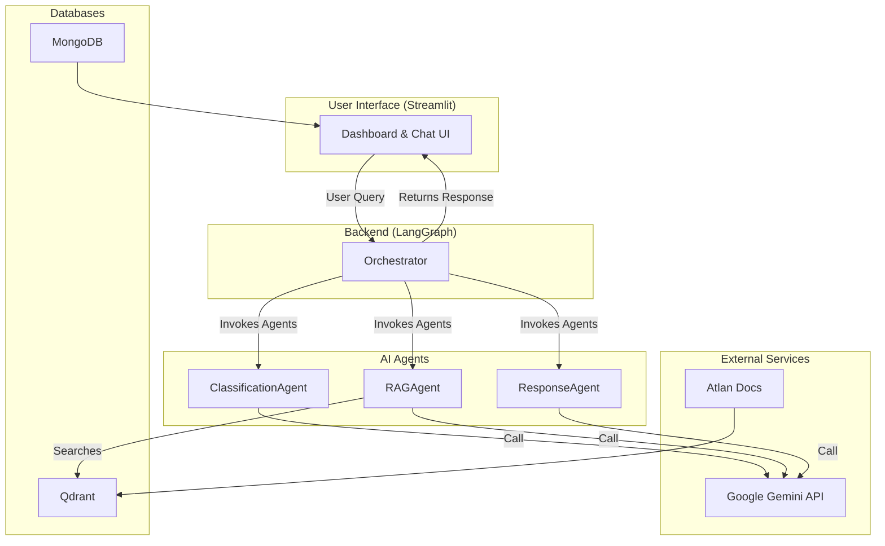

# Atlan Customer Support Copilot


This repository contains the implementation of the Atlan Customer Support Copilot, an AI-powered system designed to automate and enhance customer support workflows.

---

## 📖 Table of Contents

-   [Project Overview](#-project-overview)
-   [Core Features](#-core-features)
-   [Architecture](#-architecture)
-   [Getting Started](#-getting-started)
-   [Running the Application](#-running-the-application)
-   [Detailed Documentation](#-detailed-documentation)

---

## 🚀 Project Overview

The Atlan Customer Support Copilot is an intelligent agent that assists support engineers by automating ticket classification, retrieving relevant information from Atlan's documentation, and helping to generate accurate, context-aware responses. The system is designed to reduce response times and improve the overall quality of customer support.

For a full overview of the project's goals and capabilities, please see the [**Project Overview document**](./docs/overview.md).

## ✨ Core Features

-   **Automated Ticket Classification**: Automatically analyzes and tags support tickets by topic, sentiment, and priority.
-   **Retrieval-Augmented Generation (RAG)**: Searches a vector database of Atlan's documentation to find factual, contextually relevant information to answer user queries.
-   **Citable Responses**: Generates answers that are grounded in the retrieved documentation and provides direct links to the source material.
-   **Interactive UI**: A Streamlit-based user interface for viewing classified tickets and interacting with the chat agent.

## 🏛️ Architecture

The system is built as a multi-agent application orchestrated by LangGraph. The main components are the User Interface, the Agent Core, the Data Ingestion Pipeline, and external services like databases and the Gemini API.

For a detailed breakdown of the components and their interactions, please see the [**Architecture Diagram**](./docs/architecture-diagram.md).



For more information on the technology choices and key design decisions, refer to the [**Tech Stack and Decisions document**](./docs/tech-stack-and-decisions.md).

---

## 🏁 Getting Started

To get the application running on your local machine, you will need to clone the repository, set up a Python virtual environment, install dependencies, and configure your environment variables.

For a complete, step-by-step guide, please follow the [**Setup and Installation Guide**](./docs/setup.md).

### Quick Setup Commands
1.  **Clone the repo**: `git clone <repo-url>`
2.  **Create and activate venv**: `python -m venv venv && source venv/bin/activate`
3.  **Install dependencies**: `pip install -r atlan_copilot/requirements.txt`
4.  **Configure environment**: Create a `.env` file in the project root (see `docs/setup.md` for details).

---

## 🏃 Running the Application

All commands should be run from the **project root directory**.

### 1. Health Check (Recommended)
Verify all your connections are working:
```bash
python atlan_copilot/tests/health_check.py
```

### 2. Load Data
Populate your MongoDB with sample data:
```bash
python atlan_copilot/scripts/load_sample_data.py
```

### 3. Run the UI
Start the Streamlit application:
```bash
streamlit run atlan_copilot/app.py
```

---

## 📚 Detailed Documentation

For more in-depth information, please refer to the documents in the `docs/` directory:

-   [**`overview.md`**](./docs/overview.md): High-level summary of the project's purpose and features.
-   [**`setup.md`**](./docs/setup.md): Detailed instructions for installation and configuration.
-   [**`tech-stack-and-decisions.md`**](./docs/tech-stack-and-decisions.md): Explanation of the technologies used and key architectural choices.
-   [**`architecture-diagram.md`**](./docs/architecture-diagram.md): A detailed, renderable diagram of the system architecture.
