# System Architecture Diagram

This document provides a visual representation of the Atlan Customer Support Copilot's architecture using Mermaid syntax. This diagram can be rendered in any Markdown viewer that supports Mermaid.

```mermaid
graph TD
    subgraph "User Interface (Streamlit)"
        A[Dashboard UI]
        B[Chat UI]
    end

    subgraph "Backend Orchestration (LangGraph)"
        C[Orchestrator]
        D[CopilotState]
    end

    subgraph "Agent Core"
        E[ClassificationAgent]
        F[RAGAgent]
        G[ResponseAgent]
    end

    subgraph "Data & Embedding Pipeline"
        H[Scrapers]
        I[ContentProcessor]
        J[GeminiEmbedder]
        K[VectorStore]
    end

    subgraph "External Services & Databases"
        L[Google Gemini API]
        M[MongoDB Atlas]
        N[Qdrant Vector DB]
        O[Atlan Documentation Sites]
    end

    %% Data Flow for RAG Pipeline (One-time/Periodic)
    O -- Fetched HTML --> H
    H -- Raw Docs --> I
    I -- Text Chunks --> J
    J -- Embeddings --> K
    K -- Upserts Points --> N

    %% Data Flow for Live Query
    B -- User Query --> C
    C -- Manages State --> D

    C -- Invokes --> E
    E -- Calls --> L
    E -- Updates State --> D

    C -- Invokes --> F
    F -- Embeds Query via --> J
    J -- Calls --> L
    F -- Searches --> N
    N -- Returns Context --> F
    F -- Updates State --> D

    C -- Invokes --> G
    G -- Calls --> L
    G -- Updates State --> D

    D -- Final Response --> C
    C -- Displays Response --> B

    %% Data Flow for Dashboard
    A -- Requests Data --> M
    M -- Provides Tickets --> A
    A -- Classifies via --> C
    C -- Stores Processed Tickets --> P[Processed Tickets Collection]

    %% Data Flow for Chat Interface
    B -- User Query --> C
    C -- Classifies & Retrieves --> D
    C -- Stores Processed Tickets --> P

    subgraph "MongoDB Collections"
        Q[Raw Tickets Collection]
        P[Processed Tickets Collection]
    end

    style A fill:#268bd2,stroke:#333,stroke-width:2px
    style B fill:#268bd2,stroke:#333,stroke-width:2px
    style C fill:#d33682,stroke:#333,stroke-width:2px
    style E fill:#859900,stroke:#333,stroke-width:2px
    style F fill:#859900,stroke:#333,stroke-width:2px
    style G fill:#859900,stroke:#333,stroke-width:2px
    style H fill:#cb4b16,stroke:#333,stroke-width:2px
    style L fill:#6c71c4,stroke:#333,stroke-width:2px
    style M fill:#b58900,stroke:#333,stroke-width:2px
    style N fill:#b58900,stroke:#333,stroke-width:2px
    style P fill:#dc3545,stroke:#333,stroke-width:2px
    style Q fill:#28a745,stroke:#333,stroke-width:2px
```

## How to Read the Diagram

-   **Blue Boxes**: Represent the user-facing parts of the Streamlit application.
-   **Pink Box**: Represents the central LangGraph orchestrator that manages the workflow.
-   **Green Boxes**: Represent the individual AI agents that perform specific tasks.
-   **Orange Boxes**: Represent the components of the data ingestion pipeline used to build the knowledge base.
-   **Purple Box**: Represents the Google Gemini API for AI model interactions.
-   **Yellow Boxes**: Represent the MongoDB and Qdrant databases that store data and embeddings.
-   **Red Box**: Represents the Processed Tickets Collection for storing classified tickets.
-   **Green Box (MongoDB)**: Represents the Raw Tickets Collection for unprocessed tickets.
-   **Arrows**: Indicate the flow of data or control between the different components.

## Data Flow Summary

### Ticket Processing Flow
1. **Raw tickets** are loaded from MongoDB Raw Tickets Collection
2. **Classification Agent** processes tickets using Gemini API
3. **Results** are stored in MongoDB Processed Tickets Collection
4. **Dashboard** displays processed tickets with analytics
5. **Chat interface** uses processed ticket data for enhanced responses

### RAG Query Flow
1. **User query** enters through Chat Interface
2. **Orchestrator** manages multi-agent workflow
3. **Classification Agent** analyzes query intent
4. **RAG Agent** searches Qdrant vector database
5. **Response Agent** generates final answer with citations
6. **Processed results** are stored in MongoDB for future reference
