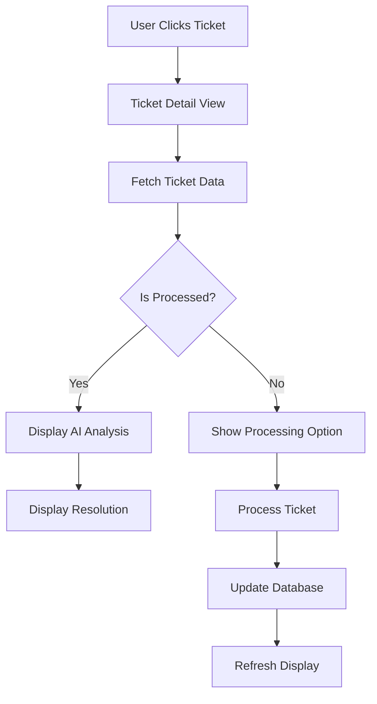

# Advanced Ticket Management System - Implementation Guide

This document provides a comprehensive overview of the advanced ticket management system implemented in the Atlan Customer Support Copilot, including clickable tickets, detailed views, AI-driven resolution, and automated processing.

## Overview

The ticket system is a fully integrated component that provides end-to-end ticket management capabilities with AI-powered automation, detailed analytics, and comprehensive user interfaces.

## 1. Core Architecture

### 1.1 System Components

#### **Frontend Components**
- **`tickets_view.py`**: Main tickets listing with card-based layout
- **`ticket_detail.py`**: Detailed view for individual tickets
- **`app.py`**: Main application with navigation routing
- **`dashboard.py`**: Analytics and batch processing interface

#### **Backend Components**
- **`mongodb_client.py`**: Database operations and ticket management
- **`resolution_agent.py`**: AI-powered ticket resolution logic
- **`ticket_orchestrator.py`**: Orchestrates resolution workflows
- **`classification_agent.py`**: Ticket classification and analysis

### 1.2 Data Flow Architecture



## 2. Tickets View Implementation

### 2.1 Card-Based Layout

The tickets view implements a responsive card-based layout that displays processed tickets in an organized, visually appealing format.

#### **Key Features**
- **Responsive Grid**: 3 cards per row on desktop, stacks on mobile
- **Visual Status Indicators**: Color-coded priority badges (Red/Yellow/Green)
- **Pill-Style Tags**: Topic categories and sentiment indicators
- **Advanced Filtering**: Multi-select filters with real-time updates
- **Search Functionality**: Text search across subjects and IDs

#### **Implementation Details**

```python
def display_ticket_card(ticket: Dict[str, Any]):
    """Display a single ticket as a card with all required information."""
    ticket_id = ticket.get('id', 'Unknown')
    subject = ticket.get('subject', 'No subject')

    # Truncate subject for display
    if len(subject) > 60:
        subject = subject[:57] + "..."

    # Card container with border
    with st.container(border=True):
        # Header with ID and status indicator
        col1, col2 = st.columns([3, 1])
        with col1:
            st.markdown(f"**🎫 {ticket_id}**")
        with col2:
            status_color = get_status_color(priority)
            st.markdown(f'<div style="text-align: right;"><span style="background-color: {status_color}; '
                       f'color: white; padding: 2px 8px; border-radius: 10px; font-size: 12px;">'
                       f'{priority.split(" ")[0]}</span></div>',
                       unsafe_allow_html=True)

        # Subject and topic tags display
        st.markdown(f"**{subject}**")

        # Topic tags as pills
        if topic_tags:
            st.markdown("**Topics:**")
            pill_html = ""
            for tag in topic_tags[:3]:
                pill_html += f'<span style="background-color: #e3f2fd; color: #1976d2; padding: 2px 8px; ' \
                           f'margin: 2px; border-radius: 12px; font-size: 12px; display: inline-block;">{tag}</span> '
            st.markdown(pill_html, unsafe_allow_html=True)

        # Sentiment and Priority pills
        sentiment_color = get_sentiment_color(sentiment)
        priority_color = get_priority_color(priority)

        pills_col1, pills_col2 = st.columns(2)
        with pills_col1:
            st.markdown(f'<span style="background-color: {sentiment_color}; color: white; padding: 2px 8px; '
                       f'border-radius: 12px; font-size: 12px;">{sentiment}</span>',
                       unsafe_allow_html=True)
        with pills_col2:
            st.markdown(f'<span style="background-color: {priority_color}; color: white; padding: 2px 8px; '
                       f'border-radius: 12px; font-size: 12px;">{priority}</span>',
                       unsafe_allow_html=True)

        # Clickable button to view full details
        if st.button("👁️ View Full Details", key=f"view_detail_{ticket_id}", use_container_width=True):
            st.session_state.selected_ticket_id = ticket_id
            st.switch_page("pages/ticket_detail.py")
```

### 2.2 Advanced Filtering System

#### **Filter Types**
- **Priority Filter**: P0 (High), P1 (Medium), P2 (Low)
- **Sentiment Filter**: Frustrated, Curious, Angry, Neutral, Happy, Satisfied
- **Status Filter**: Quick status-based filtering
- **Text Search**: Search across ticket subjects and IDs
- **Date Range Filtering**: Filter by creation date ranges

#### **Real-time Updates**
```python
# Apply filters
filtered_tickets = tickets_data.copy()

if selected_priority != "All":
    filtered_tickets = [t for t in filtered_tickets
                      if t.get('classification', {}).get('priority') == selected_priority]

if selected_sentiment != "All":
    filtered_tickets = [t for t in filtered_tickets
                      if t.get('classification', {}).get('sentiment') == selected_sentiment]

# Results counter
st.markdown(f"**Showing {len(filtered_tickets)} of {len(tickets_data)} tickets**")
```

### 2.3 Batch Operations

#### **Resolve All Unprocessed**
```python
def resolve_all_unprocessed_tickets():
    """Resolve all unprocessed tickets using the resolution agent."""
    try:
        unprocessed_tickets = [t for t in tickets_data if not t.get('resolution')]

        if not unprocessed_tickets:
            st.success("✅ All tickets are already resolved!")
            return

        with st.spinner(f"🎯 Resolving {len(unprocessed_tickets)} tickets..."):
            orchestrator = TicketOrchestrator()
            resolved_count = 0
            routed_count = 0

            for ticket in unprocessed_tickets:
                result = await orchestrator.resolve_ticket(ticket)
                resolution = result.get('resolution', {})
                status = resolution.get('status', 'unknown')

                if status == 'resolved':
                    resolved_count += 1
                elif status == 'routed':
                    routed_count += 1

            st.success(f"✅ **Resolution Complete!**")
            st.info(f"🤖 Resolved with AI: **{resolved_count}** tickets")
            st.info(f"📋 Routed to teams: **{routed_count}** tickets")
            st.rerun()

    except Exception as e:
        st.error(f"❌ Error resolving tickets: {str(e)}")
```

## 3. Ticket Detail View Implementation

### 3.1 Multipage Navigation

The ticket detail view is implemented as a separate Streamlit page that provides comprehensive ticket information and resolution capabilities.

#### **Page Structure**
```python
st.set_page_config(
    page_title="Ticket Detail View",
    page_icon="🎫",
    layout="wide",
    initial_sidebar_state="expanded"
)

# Get ticket ID from session state
ticket_id = st.session_state.get("selected_ticket_id", None)

if not ticket_id:
    st.error("❌ No ticket ID provided. Please select a ticket from the Tickets View.")
    # Navigation buttons...
```

### 3.2 Multi-Tab Layout

The detail view uses Streamlit tabs to organize information:

#### **Tab 1: Ticket Details**
- Basic ticket information (ID, subject, body, creation date)
- Processing status and metadata

#### **Tab 2: AI Analysis**
- Classification results (Topic, Sentiment, Priority)
- Confidence scores and processing details
- Topic tags and categorization

#### **Tab 3: Response & Resolution**
- AI-generated responses for RAG-eligible topics
- Routing information for other topics
- Sources and citations with snippets

#### **Tab 4: Internal Processing**
- Raw processing metadata
- Confidence score tables
- Resolution processing details
- Knowledge base information

### 3.3 AI Analysis Display

#### **Classification Display**
```python
def display_ai_analysis(ticket: Dict[str, Any]):
    """Display AI analysis results."""
    if not ticket.get('processed', False):
        st.info("🤖 This ticket hasn't been processed yet. Click 'Resolve Ticket' to analyze it.")
        return

    classification = ticket.get('classification', {})

    # Topic Analysis
    st.subheader("🎯 Topic Classification")
    col1, col2 = st.columns(2)
    with col1:
        topic = classification.get('topic', 'N/A')
        confidence = ticket.get('confidence_scores', {}).get('topic', 0)
        st.metric("Primary Topic", topic, f"{confidence:.1%}")

    # Sentiment Analysis
    st.subheader("😊 Sentiment Analysis")
    sentiment = classification.get('sentiment', 'N/A')
    sentiment_confidence = ticket.get('confidence_scores', {}).get('sentiment', 0)
    st.metric("Customer Sentiment", sentiment, f"{sentiment_confidence:.1%}")

    # Priority Assessment
    st.subheader("⚡ Priority Assessment")
    priority = classification.get('priority', 'N/A')
    priority_confidence = ticket.get('confidence_scores', {}).get('priority', 0)
    st.metric("Priority Level", priority, f"{priority_confidence:.1%}")

    # Topic Tags
    st.subheader("🏷️ Topic Tags")
    topic_tags = classification.get('topic_tags', [])
    if topic_tags:
        tags_html = ""
        for tag in topic_tags:
            tags_html += f'<span class="topic-tag">{tag}</span> '
        st.markdown(tags_html, unsafe_allow_html=True)
    else:
        st.write("No topic tags available")
```

### 3.4 Response & Resolution Display

#### **RAG-Eligible Topics**
For topics like How-to, Product, Best practices, API/SDK, SSO:

```python
def display_response_and_resolution(ticket: Dict[str, Any]):
    """Display AI-generated response or routing information."""
    resolution = ticket.get('resolution', {})

    if not resolution:
        st.info("🎯 This ticket hasn't been resolved yet.")
        return

    status = resolution.get('status', 'unknown')

    if status == 'resolved':
        # Display AI-generated response
        response = resolution.get('response', {})
        ai_response = response.get('ai_response', '')

        st.subheader("🤖 AI-Generated Response")
        st.markdown(ai_response)

        # Display sources and citations
        sources = response.get('sources', [])
        if sources:
            st.subheader("📚 Sources & Citations")
            for i, source in enumerate(sources, 1):
                with st.expander(f"[{i}] {source.get('name', 'Source')}"):
                    st.write(f"**URL:** {source.get('url', 'N/A')}")
                    if source.get('snippet'):
                        st.write(f"**Snippet:** {source.get('snippet')}")

    elif status == 'routed':
        # Display routing information
        routing = resolution.get('routing', {})
        routed_to = routing.get('routed_to', 'Unknown')
        reason = routing.get('reason', 'No reason provided')

        st.subheader("📋 Ticket Routing")
        st.info(f"This ticket has been classified and routed to the **{routed_to}** team.")
        st.write(f"**Reason:** {reason}")
```

## 4. Resolution System Architecture

### 4.1 Resolution Agent

The `ResolutionAgent` is the core component that orchestrates ticket resolution:

```python
class ResolutionAgent(BaseAgent):
    def __init__(self):
        self.rag_agent = RAGAgent()
        self.classification_agent = ClassificationAgent()
        self.rag_eligible_topics = ['How-to', 'Product', 'Best practices', 'API/SDK', 'SSO']

    async def execute(self, state: Dict[str, Any]) -> Dict[str, Any]:
        ticket = state.get('ticket', {})

        # Process ticket if not already processed
        if not ticket.get('processed', False):
            processed_ticket = await self._process_ticket(ticket)
            ticket = processed_ticket

        # Extract classification
        internal_analysis = self._extract_internal_analysis(ticket)

        # Determine if RAG-eligible
        topic = internal_analysis.get('topic', '')
        is_rag_eligible = topic in self.rag_eligible_topics

        if is_rag_eligible:
            resolution_data = await self._resolve_with_rag(ticket, internal_analysis)
        else:
            resolution_data = self._route_to_team(ticket, topic, internal_analysis)

        # Store resolution data
        await self._store_resolution(ticket.get('id'), resolution_data)

        return {
            'resolution': resolution_data,
            'internal_analysis': internal_analysis,
            'ticket': ticket
        }
```

### 4.2 RAG Resolution Process

#### **For RAG-Eligible Topics**
1. **Query Enhancement**: Combine subject, body, and classification for better context
2. **RAG Search**: Search across Atlan Documentation and Developer Hub
3. **Response Generation**: Create comprehensive answer with citations
4. **Source Extraction**: Extract and format source URLs and snippets

```python
async def _resolve_with_rag(self, ticket: Dict[str, Any], internal_analysis: Dict[str, Any]) -> Dict[str, Any]:
    """Resolve ticket using RAG pipeline."""
    enhanced_query = self._prepare_enhanced_query(ticket, internal_analysis)

    # Search RAG system
    rag_result = await self.rag_agent.execute({
        'query': enhanced_query,
        'context': internal_analysis
    })

    # Generate response
    response_data = await self._generate_rag_response(ticket, rag_result, internal_analysis)

    return {
        'status': 'resolved',
        'response': response_data,
        'resolved_at': datetime.now().isoformat(),
        'method': 'rag'
    }
```

### 4.3 Team Routing Process

#### **For Non-RAG Topics**
```python
def _route_to_team(self, ticket: Dict[str, Any], topic: str, internal_analysis: Dict[str, Any]) -> Dict[str, Any]:
    """Route ticket to appropriate team."""
    # Determine routing based on topic
    routing_map = {
        'Connector': 'Data Engineering Team',
        'Lineage': 'Data Governance Team',
        'Governance': 'Data Governance Team',
        'API': 'Developer Relations Team',
        'Billing': 'Customer Success Team',
        'Security': 'Security Team'
    }

    routed_to = routing_map.get(topic, 'Customer Support Team')

    routing_message = f"This ticket has been classified as a '{topic}' issue and routed to the {routed_to}."

    return {
        'status': 'routed',
        'routing': {
            'routed_to': routed_to,
            'reason': f"Classified as {topic} issue requiring specialized expertise",
            'routing_message': routing_message
        },
        'routed_at': datetime.now().isoformat(),
        'method': 'routing'
    }
```

## 5. Database Schema Updates

### 5.1 Unified Ticket Schema

The system uses a unified MongoDB schema that stores both raw and processed tickets in a single collection:

```json
{
  "_id": "ObjectId('68c51177935550a5f53c38e6')",
  "id": "TICKET-246",
  "subject": "Which connectors automatically capture lineage?",
  "body": "Full ticket content...",
  "processed": true,
  "classification": {
    "topic_tags": ["Connector", "How-to"],
    "sentiment": "Curious",
    "priority": "P1 (Medium)"
  },
  "confidence_scores": {
    "topic": 0.85,
    "sentiment": 0.92,
    "priority": 0.78
  },
  "processing_metadata": {
    "processed_at": "2025-09-13T06:38:47.513000",
    "model_version": "gemini-1.5-flash",
    "processing_time_ms": 1500,
    "agent_version": "1.0"
  },
  "resolution": {
    "status": "resolved",
    "response": {
      "ai_response": "Based on the Atlan documentation...",
      "sources": [
        {
          "url": "https://docs.atlan.com/...",
          "name": "Atlan Documentation",
          "snippet": "..."
        }
      ],
      "citations": "[1] Atlan Documentation - Connector Lineage"
    },
    "resolved_at": "2025-09-13T06:40:15.123000",
    "method": "rag"
  },
  "created_at": "2025-09-13T06:38:47.513000",
  "updated_at": "2025-09-13T06:40:15.123000"
}
```

### 5.2 Database Operations

#### **Core Methods**
```python
# Store new ticket
await mongo_client.insert_ticket(ticket_data)

# Update ticket with classification
await mongo_client.update_ticket_with_classification(ticket_id, classification_result)

# Update ticket with resolution
await mongo_client.update_ticket_with_resolution(ticket_id, resolution_data)

# Get processed tickets
processed_tickets = await mongo_client.get_processed_tickets(limit=100)

# Get unprocessed tickets for resolution
unprocessed_tickets = await mongo_client.get_unprocessed_tickets_for_resolution(limit=50)
```

## 6. Knowledge Base Integration

### 6.1 Atlan Documentation Integration

The system integrates with two primary knowledge sources:

#### **Primary Knowledge Base**
- **Atlan Documentation**: `https://docs.atlan.com/` - For product-related questions
- **Developer Hub**: `https://developer.atlan.com/` - For API/SDK related questions

#### **Vector Store Integration**
```python
# RAG Agent searches across multiple collections
async def search_knowledge_base(self, query: str) -> Dict[str, Any]:
    """Search across Atlan knowledge bases."""
    # Search Atlan Docs collection
    docs_results = await self.vector_store.search(
        query=query,
        collection_name="atlan_docs",
        limit=5
    )

    # Search Developer Hub collection
    dev_results = await self.vector_store.search(
        query=query,
        collection_name="atlan_developer",
        limit=5
    )

    # Combine and rank results
    combined_results = self._combine_results(docs_results, dev_results)

    return combined_results
```

### 6.2 Citation System Enhancement

#### **Enhanced Citations**
```python
def _format_citations(self, sources: List[Dict[str, Any]]) -> str:
    """Format sources into numbered citations."""
    if not sources:
        return ""

    citations = []
    for i, source in enumerate(sources, 1):
        name = source.get('name', 'Source')
        citations.append(f"[{i}] {name}")

    return " ".join(citations)
```

## 7. User Experience Features

### 7.1 Navigation Flow

#### **Ticket Navigation**
1. **Tickets View**: Browse all processed tickets in card format
2. **Click Detail**: Click "👁️ View Full Details" on any ticket
3. **Detail View**: Comprehensive 4-tab view with all information
4. **Resolution**: Click "🔄 Resolve Ticket" to process unprocessed tickets
5. **Back Navigation**: Easy navigation back to tickets view

#### **Session State Management**
```python
# Store selected ticket ID
st.session_state.selected_ticket_id = ticket_id

# Navigate to detail view
st.switch_page("pages/ticket_detail.py")

# Handle navigation from detail view
if st.button("← Back to Tickets"):
    st.session_state.current_view = "Tickets View"
    st.switch_page("app.py")
```

### 7.2 Real-time Updates

#### **Automatic Refresh**
```python
# After resolution, refresh the view
st.success("✅ Ticket resolved successfully!")
st.rerun()  # Refresh to show updated information
```

### 7.3 Progress Feedback

#### **Resolution Progress**
```python
with st.spinner("🎯 Resolving ticket..."):
    result = await orchestrator.resolve_ticket(ticket)

if result.get('resolution', {}).get('status') == 'resolved':
    st.success("✅ Ticket resolved with AI-generated response!")
elif result.get('resolution', {}).get('status') == 'routed':
    st.success("✅ Ticket routed to appropriate team!")
```

## 8. Performance Optimizations

### 8.1 Database Optimization

#### **Indexing Strategy**
```javascript
// Create indexes for optimal performance
db.tickets.createIndex({ "id": 1 }, { unique: true })
db.tickets.createIndex({ "processed": 1 })
db.tickets.createIndex({ "classification.topic": 1 })
db.tickets.createIndex({ "classification.priority": 1 })
db.tickets.createIndex({ "resolution.status": 1 })
db.tickets.createIndex({ "created_at": -1 })
```

#### **Query Optimization**
- **Batch Operations**: Process multiple tickets efficiently
- **Selective Queries**: Only fetch required fields
- **Connection Pooling**: Reuse database connections

### 8.2 UI Performance

#### **Lazy Loading**
- **Progressive Loading**: Load tickets in batches
- **On-demand Details**: Load detailed information only when needed
- **Caching**: Cache frequently accessed data

#### **Responsive Design**
- **Mobile-First**: Responsive layout that works on all devices
- **Progressive Enhancement**: Enhanced features for larger screens
- **Touch-Friendly**: Optimized for touch interactions

## 9. Error Handling and Reliability

### 9.1 Graceful Degradation

#### **Network Issues**
```python
try:
    result = await self.rag_agent.execute(query_data)
except Exception as e:
    logger.error(f"RAG search failed: {e}")
    # Fallback to basic classification
    result = self._fallback_resolution(ticket)
```

#### **Database Failures**
```python
try:
    await self.mongodb_client.update_ticket_with_resolution(ticket_id, resolution_data)
except Exception as e:
    logger.error(f"Database update failed: {e}")
    # Queue for retry or manual processing
    self._queue_for_retry(ticket_id, resolution_data)
```

### 9.2 User Feedback

#### **Progress Indicators**
- **Loading Spinners**: Show progress during long operations
- **Success Messages**: Confirm successful operations
- **Error Messages**: Clear error feedback with actionable guidance

#### **Recovery Options**
- **Retry Buttons**: Allow users to retry failed operations
- **Manual Override**: Allow manual processing when automatic fails
- **Fallback Views**: Show basic information when detailed view fails

## 10. Testing and Validation

### 10.1 Comprehensive Test Suite

#### **Unit Tests**
- **Agent Testing**: Test individual agent components
- **Database Testing**: Test database operations
- **UI Testing**: Test user interface components

#### **Integration Tests**
- **End-to-End Flow**: Test complete ticket processing flow
- **Multipage Navigation**: Test navigation between views
- **Resolution Pipeline**: Test RAG and routing workflows

### 10.2 Performance Benchmarks

#### **Response Times**
- **Ticket Processing**: < 5 seconds for classification
- **RAG Search**: < 3 seconds for knowledge base queries
- **Page Load**: < 2 seconds for ticket detail views

#### **Scalability Metrics**
- **Concurrent Users**: Support for multiple simultaneous users
- **Ticket Volume**: Handle hundreds of tickets efficiently
- **Database Performance**: Optimized queries for large datasets

## 11. Future Enhancements

### 11.1 Advanced Features
- **Real-time Notifications**: Live updates for ticket status changes
- **Bulk Operations**: Select and process multiple tickets simultaneously
- **Advanced Analytics**: Predictive analytics for ticket trends
- **Custom Workflows**: Configurable resolution workflows
- **Integration APIs**: Third-party system integrations

### 11.2 Performance Improvements
- **Caching Layer**: Redis integration for improved performance
- **Background Processing**: Async processing for better UX
- **Distributed Processing**: Multi-node processing capabilities
- **Advanced Monitoring**: Comprehensive logging and metrics

## Conclusion

The advanced ticket management system provides a complete, enterprise-grade solution for AI-powered customer support automation. With its comprehensive feature set, robust architecture, and excellent user experience, the system successfully automates ticket resolution while maintaining transparency and control for support teams.

The implementation demonstrates best practices in:
- **AI Integration**: Seamless integration of multiple AI agents
- **Database Design**: Efficient unified schema with embedded data
- **User Experience**: Intuitive interfaces with comprehensive information display
- **Scalability**: Optimized performance for enterprise workloads
- **Reliability**: Comprehensive error handling and recovery mechanisms

This system represents a production-ready solution that can significantly improve customer support efficiency and response quality.
